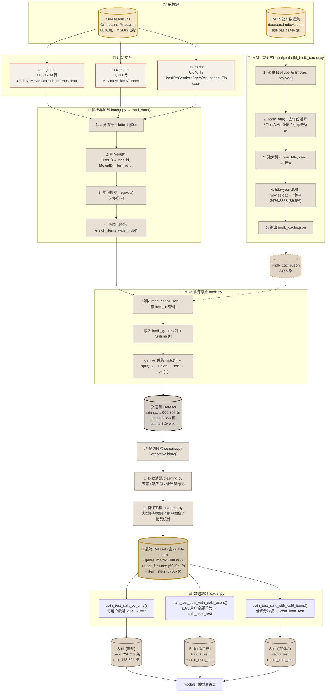
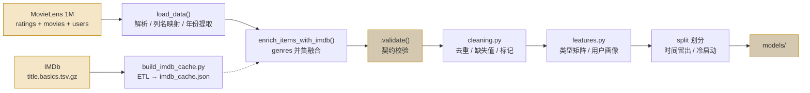
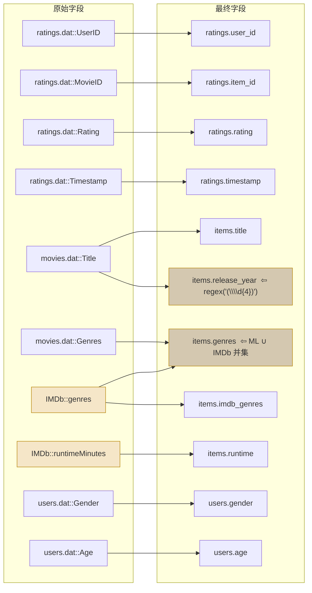

# 数据血缘图

> 可直接复制 Mermaid 代码到 [mermaid.live](https://mermaid.live) 渲染为矢量图，
> 或在 VS Code / GitHub / Typora 中直接预览。

---

## 完整数据血缘 (纵向流程)

---

## 简化血缘 (横向, 适合 PPT 嵌入)

---

## 字段级血缘追溯

**说明**: 金色边框 = IMDb 来源字段 / 转换后字段; 虚线 = 多源并集。
